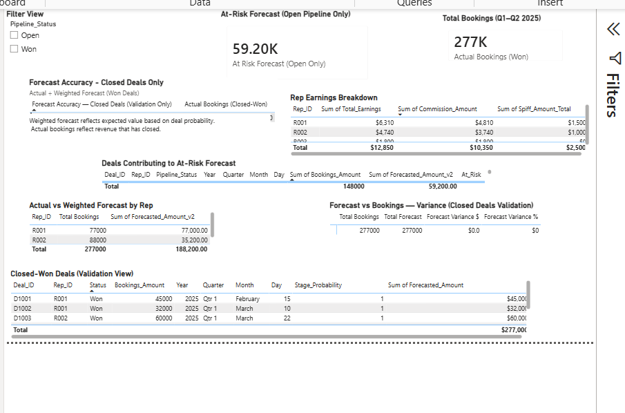

# sales-forecast-validation

Power BI model demonstrating weighted vs actual forecast reconciliation,
open-pipeline risk isolation, and closed-deal validation.

---

## Forecast Validation – Power BI Example

This repository demonstrates how weighted forecasts and actual bookings
behave differently **before** and **after** deal close, and why variance
intentionally resolves to zero in closed-deal views.

The model separates:
- **Open pipeline risk** (where forecast uncertainty exists)
- **Closed-deal validation** (where forecast accuracy is confirmed)

This prevents closed revenue from masking pipeline risk.

---

## Closed-Deal Validation (Why Variance = 0)

**What this view represents**

- **Actual bookings** reflect revenue that has closed  
- **Weighted forecast** reflects expected value *prior* to close  
- Once deals close, weighted forecast collapses into actual  
- As a result, **variance resolves to zero by design** in closed-deal views  

This view exists to validate forecasting logic — not to measure pipeline risk.

---

## Why This Matters

By isolating closed deals from open pipeline:
- Forecast accuracy can be validated cleanly
- Open-pipeline risk can be analyzed without contamination
- Stakeholders can trust both numbers for their intended purpose

This pattern mirrors real-world revenue operations workflows where
forecast confidence and revenue recognition must remain distinct.

